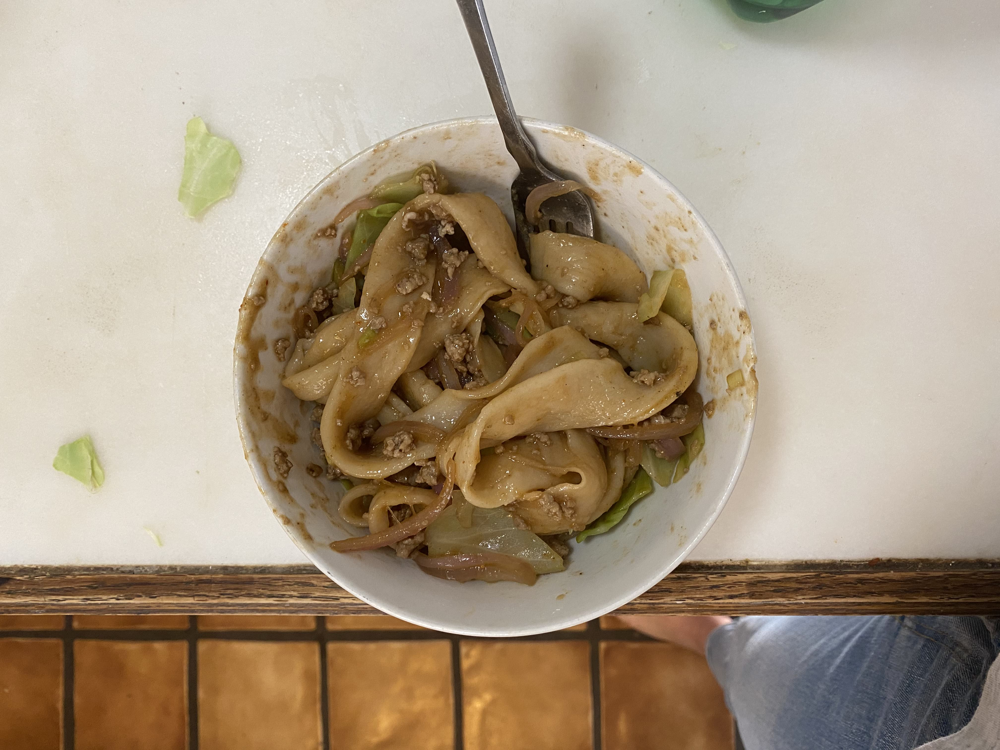
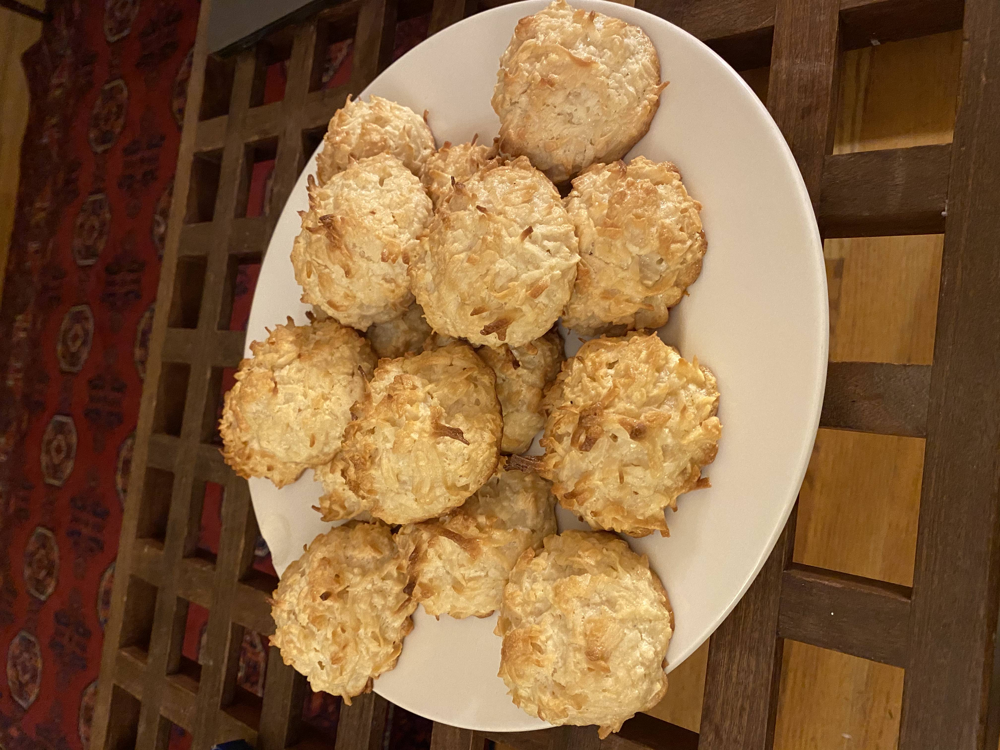
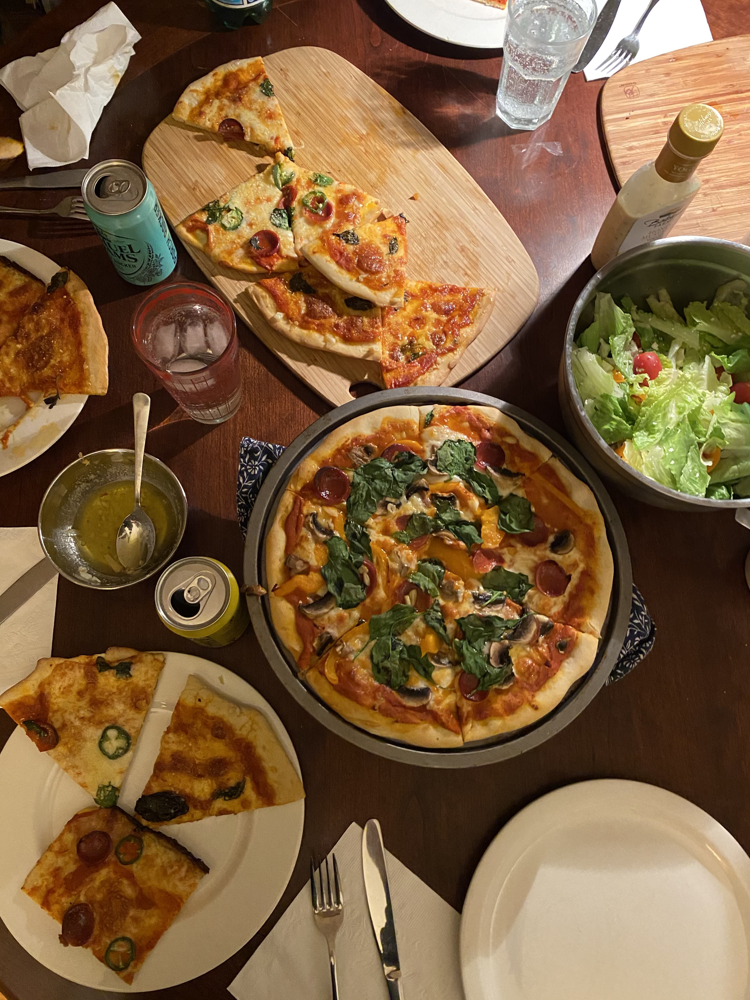
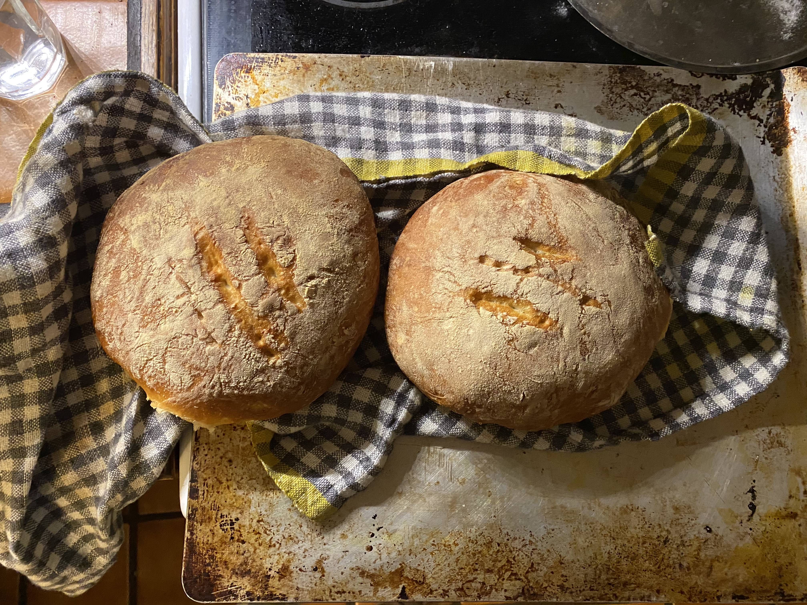
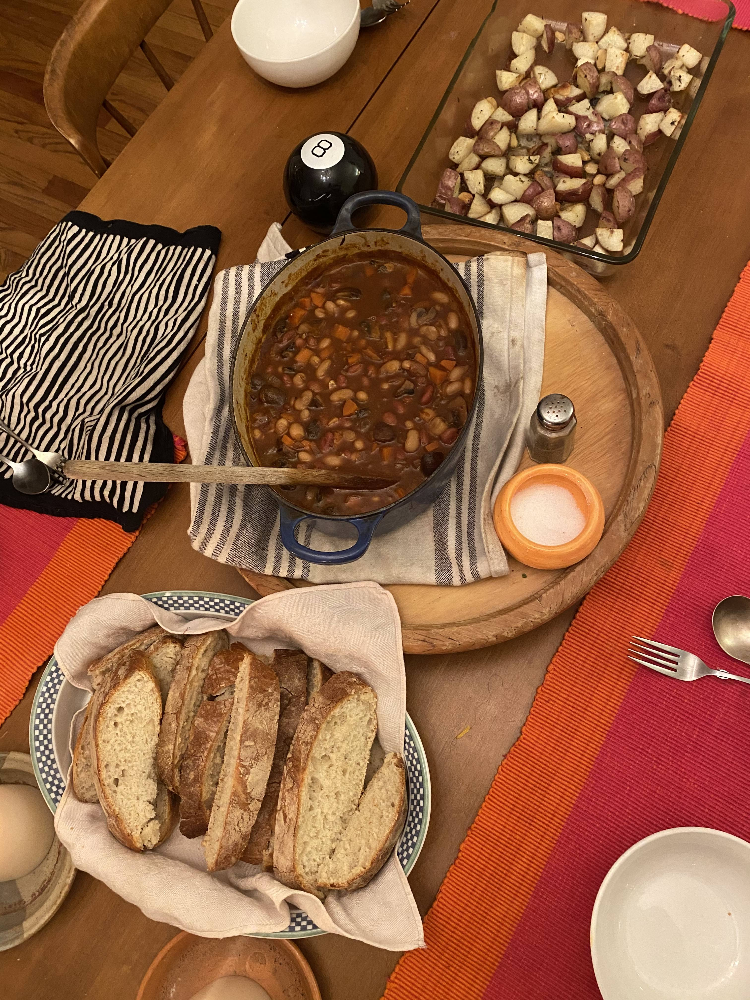
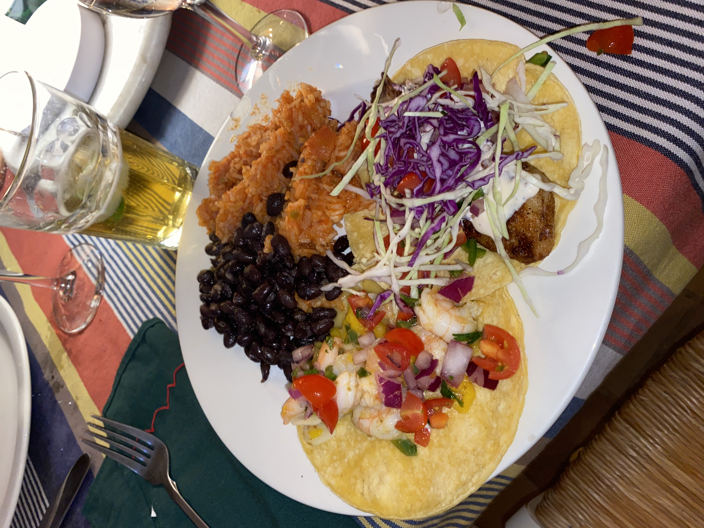
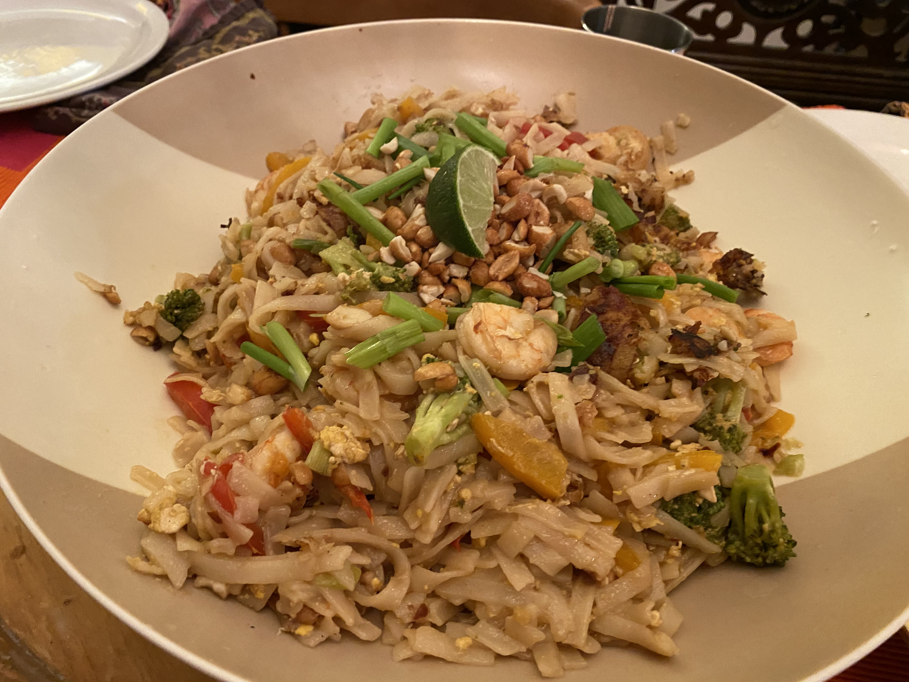
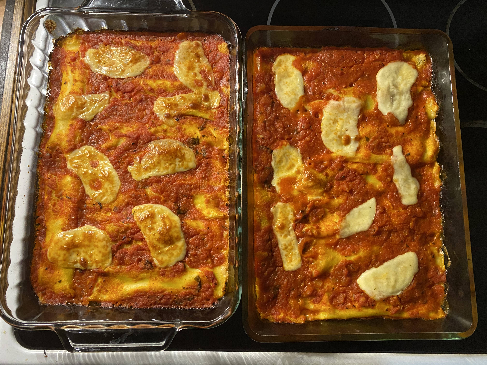
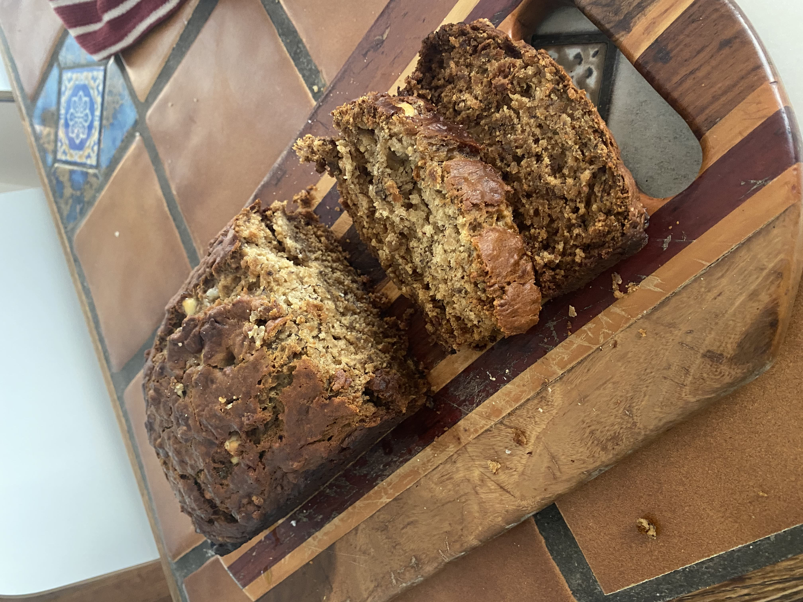

### Tomato and onion focaccia ###

### Homemade sausage ravioli in marcellas hazans tomato sauce + pasta puttanesca ###

### hand pulled xian noodles (拉面) with pork ###

### chicken Shawarma with flavorful rice, sumac Salad, and accompaniments ###

### coconut macaroons ###

### homemade New York style pizzas ###

### crusty bread ###

### beans au vin with Provençal potatoes and crusty bread ###

### Baja fish and mango and shrimp tacos with black beans and Mexican rice ###

### pad Thai ###

### homemade manicotti ###

### banana bread with white chocolate chips ###

### Homemade fettuccine in 4 hour Bolognese sauce ###

