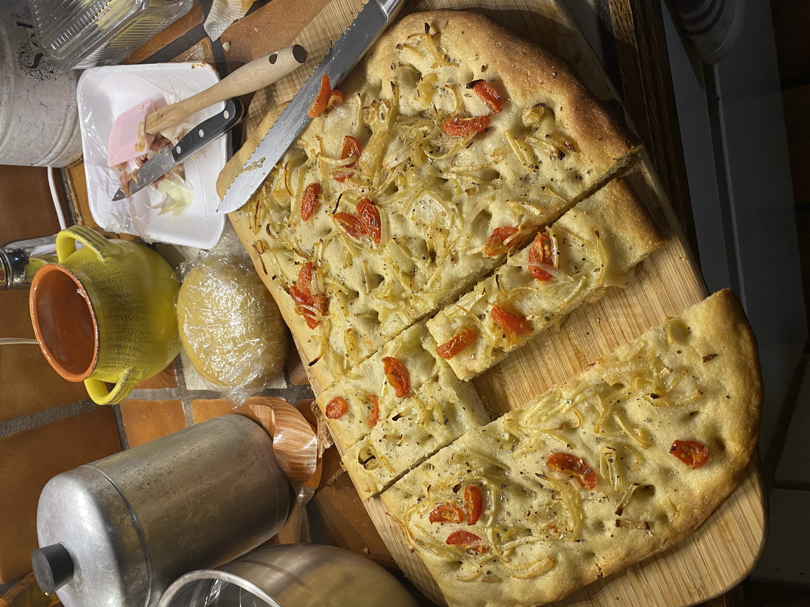
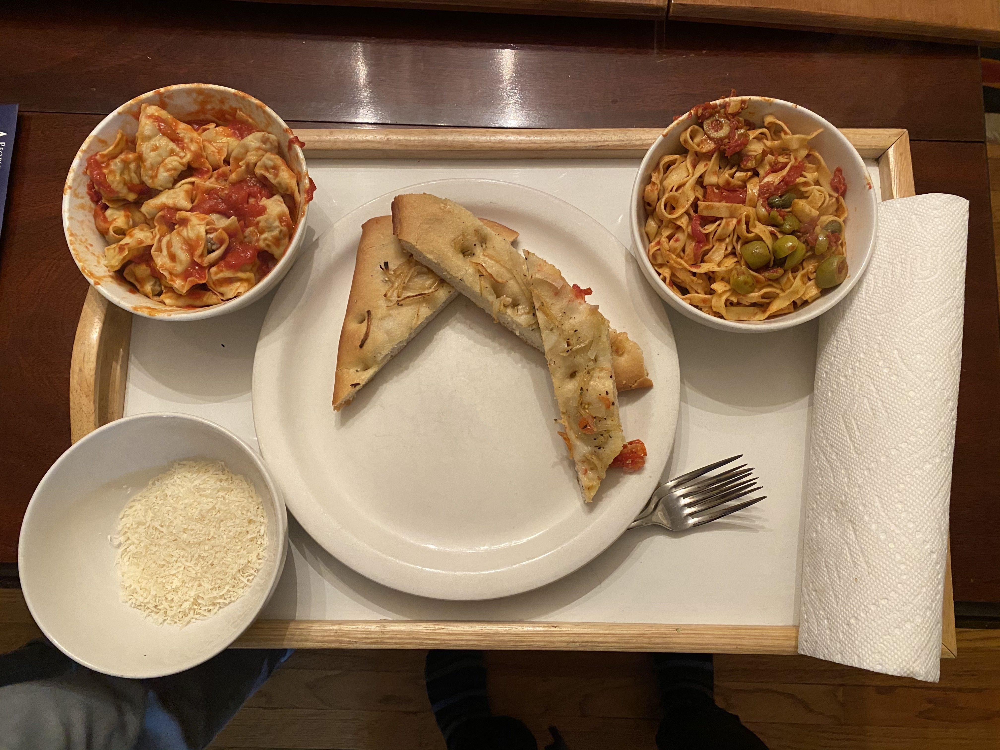
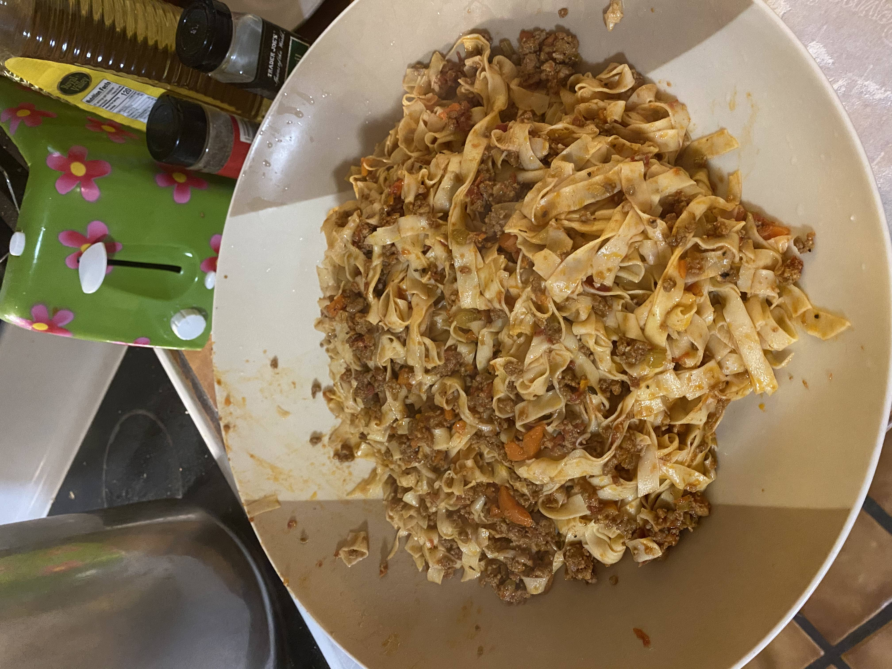
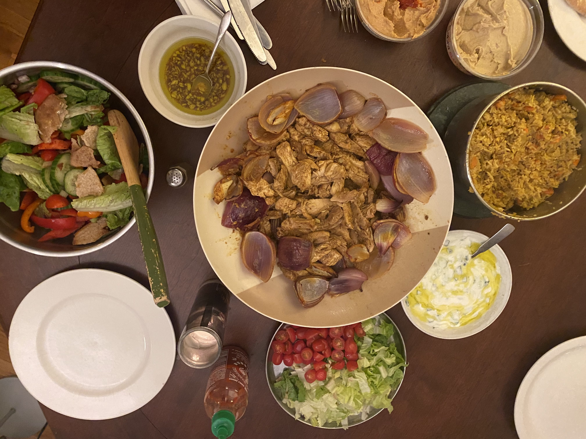

Marisa dumped all these pics on me and I was floored. Looks like they're eating good in Connecticut.

### Tomato and onion focaccia ###

plated with some
### Homemade sausage ravioli in marcellas hazans tomato sauce + pasta puttanesca ###

### hand pulled xian noodles (拉面) with pork ###

### chicken Shawarma with flavorful rice, sumac Salad, and accompaniments ###

